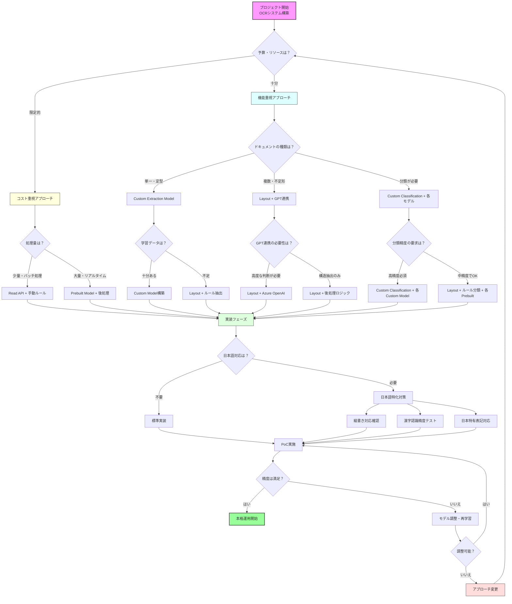

## はじめに

AzureのDocument Intelligence（旧Form Recognizer）は、OCRの枠を超えた構造化・意味理解が可能な強力なドキュメント解析サービスです。

とはいえ、いざ使おうと思うと、
- どのモデルを使えばいいのか分からない
- prebuiltって日本語で本当に使えるの？
- 結局、GPTと組み合わせないといけないの？

…といった疑問が多く出てきます。

この記事では、**「OCRをやりたい」と思ったときにどのアプローチを取ればよいのか**を、実務目線で整理してお届けします。

## よくある誤解：prebuiltモデルって本当に使えるの？

Azureには `prebuilt-invoice` や `prebuilt-receipt` といった定型帳票向けモデルが用意されていますが、**そのまま日本語の請求書やレシートに使えるかというと、答えはNoに近いです**。

### 理由は主に3つ：

1. **米国向けに設計されており、フィールド名や帳票構成が日本とズレている**
   - 例：「Invoice Number」vs「請求書番号」、「Due Date」vs「支払期限」
   
2. **漢字や縦書き、括弧付き社名などで精度が下がる**
   - 例：「株式会社（株）」のような日本特有の表記
   
3. **「請求書と納品書が1枚にまとまっている」など、日本独特の運用に弱い**
   - 米国では請求書と納品書は別々が一般的

つまり、**PoCで一度試してみる価値はありますが、実務ではCustomモデルやGPT連携が主戦力になります。**

## モデル選定の基本フロー

以下に、**OCRをやりたいと思ったときにどのモデルを使えばいいのか**を整理したフローチャートを示します。

```mermaid
flowchart TD
    A[開始<br/>OCRしたいドキュメントがある] --> B{テキストのみが欲しい？}
    B -- はい --> C[Read API<br/>(文字読み取りのみ)]
    B -- いいえ --> D{定型帳票か？}
    D -- 請求書・領収書・名刺など標準フォーマット --> E[Prebuilt Model<br/>(invoice/receipt/businessCard/contract/ID)]
    D -- いいえ --> F{自社専用 or 独自レイアウトか？}
    F -- はい --> G[Custom Extraction Model]
    F -- いいえ --> H{複数種類 or 意味理解が必要か？}
    H -- 種類の自動分類だけ --> I[Custom Classification Model<br/>(Preview)]
    H -- 内容の要約・文脈判断まで --> J[Layout + GPT連携]
    H -- 単に構造解析だけ --> K[Prebuilt Document / Layout Model]

    style A fill:#f9f,stroke:#333,stroke-width:2px
    style C fill:#bbf,stroke:#333
    style E fill:#bbf,stroke:#333
    style G fill:#bbf,stroke:#333
    style I fill:#bbf,stroke:#333
    style J fill:#bbf,stroke:#333
    style K fill:#bbf,stroke:#333
```

## 現場目線で考えるモデルの使い分け

| 構成パターン | 向いているユースケース | コメント |
|-------------|---------------------|----------|
| **Read API** | 単純なOCRで文字が読めれば十分 | 軽量・高速だが構造認識はない |
| **Prebuilt Model** | 英文帳票、海外ベンダーとのやり取り | 日本語には弱い。PoC用として使える |
| **Custom Extraction Model** | 自社帳票が定型で構造が決まっている | 日本の定型帳票には最も実用的 |
| **Layout + GPT連携** | 構造がバラバラ／意味理解が必要 | 「どれが請求金額？」などの文脈解釈が可能 |
| **Prebuilt Document / Layout Model** | 構造抽出だけしたい、RAGなどに使いたい | 文書群の構造解析に便利 |
| **Custom Classification Model** | 書類の種類（納品書？請求書？）を自動判別 | 現在はPreview。分類タスクに強み |

## 具体例：どれが合うかを考えるときの目安

| ドキュメントのタイプ | 推奨構成 | 理由 |
|-------------------|----------|------|
| **英文請求書・標準テンプレート** | Prebuilt invoice | 米国標準フォーマットに最適化済み |
| **日本語の定型請求書** | Custom Extraction Model | 自社フォーマットに学習させる必要 |
| **建設業の日報、検査記録など独自帳票** | Custom Extraction Model | 業界特有のフォーマットに対応 |
| **スキャン画像、FAXのOCR** | Read API + ルール抽出 | 構造化不要、テキスト抽出のみ |
| **複数種類の書類をまとめて処理** | Layout + GPT連携 | 種類判別と内容理解の両方が必要 |
| **要約や判断をAIに任せたい** | Layout + GPT連携 | 文脈理解と判断ロジックが必要 |

## 実装時の注意点

### 1. 段階的なアプローチを推奨

いきなり完璧なシステムを目指すのではなく、以下の順序で進めることをお勧めします：

1. **PoCフェーズ**: Prebuiltモデルで試行錯誤
2. **構造化フェーズ**: Layoutモデルで構造抽出
3. **カスタマイズフェーズ**: Customモデルで学習
4. **高度化フェーズ**: GPT連携で意味理解

### 2. 日本語特有の考慮事項

- **縦書き対応**: 一部のモデルは縦書きに弱い
- **漢字認識精度**: 複雑な漢字や略字への対応
- **フォント依存**: 手書きや特殊フォントへの対応

### 3. コストと精度のバランス

| モデル | コスト | 精度 | 学習時間 |
|--------|--------|------|----------|
| Read API | 低 | 中 | 不要 |
| Prebuilt | 中 | 中〜高 | 不要 |
| Custom | 高 | 高 | 必要 |
| Layout + GPT | 高 | 最高 | 不要 |

## おわりに

Document Intelligenceは、単なるOCRツールではなく、「文書を読むAI」へと進化しています。

とはいえ、日本の業務文化や帳票形式に合わせるには、モデルの選定と構成の工夫が必要不可欠です。

「prebuiltがうまくいかなかった…」という段階で終わらず、

- **Layoutモデルで構造を取り出す**
- **Customモデルで学習する**
- **GPTで判断や要約を加える**

といった段階的なアプローチを検討することで、現場にフィットしたAI OCRを構築することが可能です。

## 実践的なOCR方法・使用スタック選定フロー

実際のプロジェクトでOCRシステムを構築する際の、より詳細な選定フローチャートです。



### フロー解説

#### 1. 予算・リソースによる分岐
- **コスト重視**: 限られた予算で最大効果を狙う
- **機能重視**: 精度と機能を優先し、コストは二の次

#### 2. コスト重視アプローチ
- **Read API + 手動ルール**: 最も安価だが、後処理の工数が必要
- **Prebuilt Model + 後処理**: バランス型、精度は中程度

#### 3. 機能重視アプローチ
- **Custom Extraction Model**: 単一の定型ドキュメントに最適
- **Layout + GPT連携**: 複雑なドキュメントに対応
- **Custom Classification**: 複数種類のドキュメントを自動分類

#### 4. 日本語対応の考慮
- **縦書き対応**: 一部モデルは縦書きに弱い
- **漢字認識精度**: 複雑な漢字や略字への対応
- **日本特有表記**: 「（株）」「㈱」などの対応

### 次のステップ

Document Intelligenceの導入を検討されている方は、まずは以下の順序で進めることをお勧めします：

1. **Read APIで基本的なOCR精度を確認**
2. **PrebuiltモデルでPoCを実施**
3. **Layoutモデルで構造抽出を試行**
4. **必要に応じてCustomモデルを検討**
5. **高度な要件があればGPT連携を検討**

この段階的なアプローチにより、リスクを最小限に抑えながら、効果的なドキュメント解析システムを構築できます。

