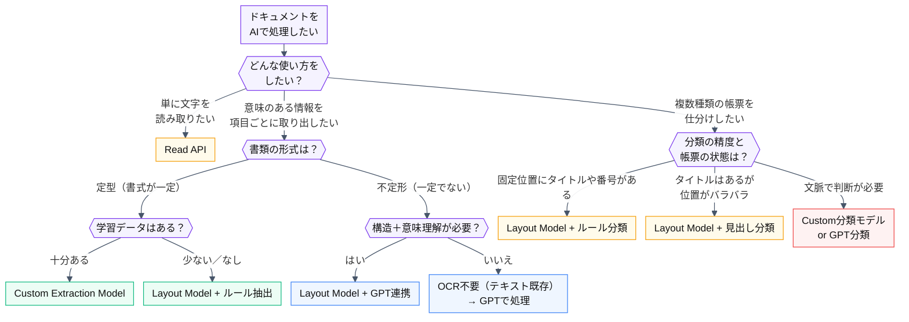

# Document Intelligenceは迷う

Azure AI Document Intelligence（旧Form Recognizer）は、
ドキュメントからテキストや構造化データを自動で抽出できる、**「読むAI」** です。
従来のOCRとは違い、**文書のレイアウトや構造も理解できる** のが大きな特があり、
帳票処理やドキュメント読み取り自動化における強いパートナーになってくれます。

とはいえ、いざ使おうと思うと、

- **どのモデルを使えばいいの？**
- **GPTと組み合わせる必要ある？**
- **事前構築済みモデルって日本語の文書でも使えるの？**

…といった疑問が多く出てきます。

そこで、この記事では 
**「AzureでOCR処理をやってみたいけど、どこから手を付ければいいかわからない」** 
という方向けに **目的や帳票の特性ごとに適したモデル選定フロー** を整理してみました。

Microsoftのリファレンスはいくつもありますので、入口の補足資料的になればいいなと思います。

https://learn.microsoft.com/ja-jp/azure/ai-services/document-intelligence/?view=doc-intel-4.0.0

*モデル構築を始めようとした際に出てくるポータル画面。迷う。*

*モデルIDとそのIDで実行できることの一覧。下にはもっとある。多い。*

## 簡単な仕組みをおさらい
Document Intelligenceを使い始めるには、まずAzure上でリソースを作成し、
**エンドポイントとアクセスキー**を取得するところからスタートします。

その後は用途や技術スキルに応じて、以下のような方法でドキュメントを送信・解析できます。

* REST API：バイナリやURL経由でドキュメントをPOST
* 各種SDK（.NET / Java / Python / Node.js）：コードから実装
* Power Automate：ノーコードでMicrosoft製品と連携
* Webポータル：ブラウザからファイルアップロード＆結果確認が可能

送信されたドキュメントの抽出された結果はJSON形式で返ってきます。このデータを、

* **抽出データをデータベースに登録する**
* **Power BIなどで可視化する**
* **他の業務システムに連携する**

等のように活用することで、業務に組み込むことが可能です。

特に便利なのが**Webポータル**の存在です。
ドキュメントをアップロードし、その場ですぐJSON出力を確認できるため、

* **PoCやそれ以前の検証したいとき**
* **どのモデルでどんな精度が出るか確認したいとき**
* **経営層向けにサービス概要を共有したいとき**

などにぴったりです。
ポータルで試せるのは一部機能のみでGPT連携や複雑なワークフローは非対応ですが、
"とりあえず試してみる"のハードルが低いことは何でも嬉しいですね。

*layout Modelのプレビュー画面*

# モデル選定

## 基本フロー

実際に「OCRをやりたい！」と思った際、最適なモデルはドキュメントの種類や業務要件によって大きく変わります。ここがDocument Intelligenceの良いところでもあり、敷居を感じやすい箇所でもあると感じています。

ということで **どのモデルを使えばいいのか** を整理したフローチャートを示します。
少し小さくなってしまい恐縮ですが、
「こういうケースではこういうモデルを選べばいいのか～」と全体感をざっくり掴んでいただけると嬉しいです。

## 構成補足

先ほどのフロー図の対応表です。いくつか補足を記載しています。

| 構成                         | 想定シーン・具体例                                     | この構成を選ぶ理由                     | 導入しやすさ        |
| --------------------------- | --------------------------------------------- | ----------------------------- | ----------------- |
| **Read API**                | 手書きメモやFAXのOCR 内容を全文テキスト化したい                | 構造理解不要・軽量・高速。コストも最小限          | ★★★★★ 非常に簡単    |
| **Custom Extraction Model** | 請求書・納品書など自社フォーマットが固定の帳票                       | ラベル・位置が固定 → 高精度な項目抽出が可能       | ★★☆☆☆ 学習データが必要   |
| **Layout Model + ルール抽出**    | 構造はあるがフォーマットが不安定な帳票（例：日報、検査票） Customには届かない | 表や段組を構造化し、手動ルールで項目抽出できる       | ★★★☆☆ ルール設計が鍵    |
| **Layout Model + GPT連携**    | 自由記述や契約書、調査票など文脈の理解が必要な文書                     | Layoutで構造を抽出 → GPTで意味理解・要約・判断 | ★★★★☆ コストと応答時間注意 |
| **GPTのみ / テキスト送信**          | 文章だけが必要なチャットや問い合わせ文書など                   | テキストさえ取れればよく、構造抽出不要           | ★★★★★ 超シンプル    |
| **Layout Model + ルール分類**    | 書類の決まった位置にタイトルや番号がある 帳票を種類ごとに分けたい          | Layoutで見出しや番号を取得 → 手動ルールで分類   | ★★★☆☆ 構造に依存      |
| **Layout Model + 見出し分類**    | 書式はバラバラだが先頭にタイトルがある ざっくり分けたい               | Layoutで構造取得 → タイトル欄などを使って簡易分類 | ★★★☆☆ 軽量        |
| **Custom分類モデル / GPT分類**     | 文脈や内容でしか区別がつかない文書（例：契約書と発注書の違いなど）             | 意味を理解して分類する必要があり、精度要求も高め      | ★★☆☆☆ 構築・学習が必要   |

# よくある疑問

## どれくらい学習データ必要？

「どのモデルを選べばいいのか？」という話と同じくらいよくあるのが、
**「どれくらい学習データを用意すればいいのか？」** という疑問です。
結局、モデルの種類や業務用途、対象によって異なりますが、
特に以下のような場面では、学習データ量が重要になります。

| ケース                          | 必要な学習データの傾向                       |
| --------------------------- | --------------------------------------------- |
| **Custom Extraction Model** | 1帳票パターンにつき10枚以上が目安 構造にバラつきがある場合は20〜50枚以上推奨 |
| **Custom分類モデル**             | 書類ごとの意味的な違いを学習 → それぞれ数十枚〜が望ましい                |
| **ルール抽出・簡易分類**              | 学習不要だが「十分なルール設計のためのサンプル」があると精度向上              |

また、重要なのは「枚数」だけでなく、「質」の観点も同じくらい大切です。

- 抽出・分類したい項目が網羅されているか？
- 帳票パターンのバリエーションが含まれているか？
- OCR後の揺れ（フォント・手書き・画像品質）にも耐えうるか？

たとえば、「同じ請求書」でも会社ごとにレイアウトが異なれば、それは別の学習対象になります。
逆に構造が単純で項目数も少なければ、10枚程度でも十分な精度が出るケースもあります。

## 「定型」「不定形」の違いは？

ここも難しいかと思うのが、
**「自分たちの帳票って、定型なの？不定形なの？」** という疑問です。
フローにもある通り、これはモデル（Custom / Layout等）を選ぶうえで、
重要な判断軸のひとつになります。

基本的には **「帳票の項目がいつも同じ場所にあるかどうか」** です。

- 同じ場所にある → 定型帳票（ルールベース or Customモデルが使える）
- バラバラ → 不定形帳票（構造把握や意味理解が必要なのでLayoutやGPTが必要）

| 見分けポイント      | 定型ドキュメント例                                       | 不定形ドキュメント例                                         |
| ------------ | ----------------------------------------------- | -------------------------------------------------- |
| **構造の規則性**   | いつも同じ場所に同じ項目がある                                 | 項目の場所・順番・書き方がバラバラ                                  |
| **文書フォーマット** | 1種類 or 少数パターン                                   | 社内外・部門ごとにバリエーション豊富                                 |
| **OCR後の処理**  | ルールやテンプレートで処理できる                                | 構造の認識＋意味理解が必要                                      |
| **具体的な例**    | ・ 自社フォーマットの請求書・納品書    ・ 健康診断票    ・ 交通費申請書 | ・ 自由記述の報告書/議事録    ・ 契約書（形式バラバラ）  ・ メール本文 |

ただし、一見「定型」に見えても、
以下のような場合は不定形寄りの判断が必要になることがあります。
- 手書きで書かれた注文票（書き方に個人差がある）
- 複数部署・企業が使う納品書（見た目は似ていても項目位置が違う）
- FAXやスキャン画像でフォーマットが崩れてしまう文書

結局ケースバイケースで検討する必要ある疑問でもあるかと思います。

## 事前構築済みモデルって使えるの？

以前は日本語対応がほとんとありませんでしたが、
2025年8月現在、OCR自体は日本語対応済みで精度も改善されています。
ただし、prebuilt-invoice や prebuilt-receipt など欧米圏で使用されている前提の設計も多く、日本の帳票ではフィールド抽出精度が低いケースがまだ多いです。
そのため、実務では CustomモデルやLayout＋GPT連携 が主力になることが多くなるかもしれません。
いつか日本文化の事前構築済みモデルが出ると嬉しいですよね。

https://learn.microsoft.com/ja-jp/azure/ai-services/document-intelligence/language-support/prebuilt?view=doc-intel-4.0.0&tabs=languages%2Cthermal#business-card

# おわり：どこまでAIに任せたいか

Document Intelligenceは、便利な分、
必要以上に高機能すぎる構成や逆に力不足な構成となってしまう可能性もあります。
OCRとひとくちに言っても最適なモデルは状況次第でしかなく、
大事なのは **「どの文書に対するどんな業務をどこまで任せたいか？」** です。

これはDocument Intelligenceに限らず、どのAI活用・DX推進テーマでも同じ事象にぶつかりますね。

全部にGPTを使うのもアリかもしれませんが、おそらく財布が泣きます。
- 対象とするドキュメントで実現可能な精度
- 選択すべきモデルとその構築にかかるコスト
- 業務効率化によるリターン

以上のバランスを探りながら、最適な効率化を実現できると嬉しいですね。

