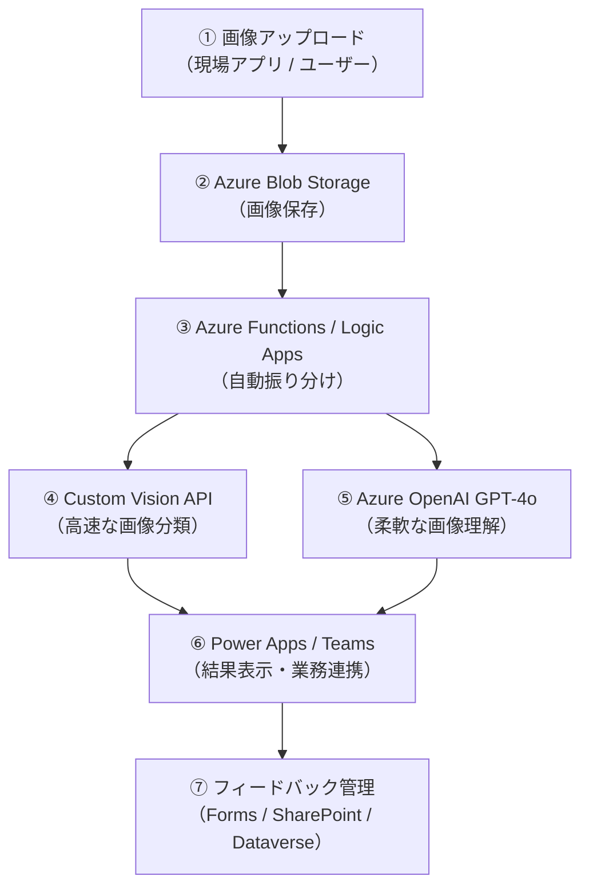

Azure Custom Visionは、**機械学習の専門的知識がなくても自社専用の画像分類モデルを構築しやすいMicrosoft Azureのサービス** です。

ただし、実際に現場で高精度な画像認識システムを運用しようとするには、1回のモデル作成で済むことは少なく、様々な課題にぶつかります。
この記事では、Custom Vision導入における代表的な課題とその解決策を5つの観点からわかりやすく解説します。

基本的な概要・導入は公式や既存の解説記事を参照ください。

https://learn.microsoft.com/ja-jp/azure/ai-services/custom-vision-service/overview

https://www.ai-souken.com/article/azure-custom-vision-overview

## 1. 十分な画像データを集めることが想像以上に大変


Custom Visionでは、内部で事前学習済みの深層学習モデル（ResNetなど）を活用する **転移学習** が行われているため、少量データでもある程度の精度を実現できます。

1クラスあたり15枚程度の画像からでも学習を開始できますが、Microsoftの公式ドキュメントでは **「50枚以上／クラス」を推奨** しています。

しかし、これはあくまでオブジェクトの対象や規模によって異なる話であり、実運用レベルの安定性を目指すなら、クラスごとに数百〜数千枚規模の画像が理想です。

> ―――どのくらいの量のデータが必要ですか?
 AI Custom Vision は、画像間の主な違いをすばやく認識するように最適化されているので、少量のデータを含むモデルでプロトタイプの作成を始めることができます。ラベルあたり 50 個の画像から開始することをおすすめします。問題の複雑さと必要な精度に応じて、最終的なモデルに数百または数千個のサンプルが必要になる場合があります。


https://azure.microsoft.com/ja-jp/products/ai-services/ai-custom-vision?msockid=3a7a5dee8fef698520c848cc8e1d68e7


### ⭕️データ拡張と収集体制の整備

まずは、限られたデータを最大限に活かす **データ拡張（Data Augmentation）** を行いましょう。
これは、少ない画像データでもモデルに多様性を与え、過学習を抑制し、汎化性能を高める基本的な手法です。データの収集状況に関わらず、常に実施することをおすすめします。

#### データ拡張の具体例

| 手法 | 内容 | 効果 |
|------|------|------|
| 幾何学変換 | 回転、左右反転、拡大・縮小、平行移動など | 視点や構図の違いに強くなる |
| 色調変換 | 明度・コントラスト・彩度の調整、グレースケール化など | 照明条件の違いに対応 |
| ノイズ付与 | ガウスノイズ、ブラー、部分的なマスキングなど | 現場のノイズや欠損に強くなる |
| 切り取り・合成 | 背景の切り替え、物体の一部トリミングなど | 背景依存を減らし、物体の本質に注目させる |


*幾何学変換の例 https://docs.fast.ai/vision.augment.html#affine-and-coord-tfm-on-the-gpu*

これらはCustom Visionのトレーニング前に **画像編集ツールやPythonライブラリ** を使って事前に加工するか、Custom Visionの **「Image Augmentation」機能** を活用することで実現できます。


*トレーニングの設定画面の高度な設定（Advanced training）を開くと「Image Augmentation」があります*


また、**社内で継続的に画像を撮影・収集できる体制づくり** も重要です。特に、現場での撮影品質を一定に保つためには、撮影ガイドラインの整備が不可欠です。特にCustom Visionのような画像ベースのAIでは、**データの質と量が成果を左右する最大の要因** です。


#### 撮影ガイドラインの作成方針と例

| 項目 | 推奨内容 |
|------|----------|
| 撮影アングル | 正面・斜め・真上など、用途に応じて統一 |
| 照明条件 | 自然光 or 一定の人工照明、影が入らないように |
| 背景 | 無地の背景 or 現場背景を統一（例：白布、作業台） |
| 解像度 | 最低〇〇万画素以上、ピントが合っていること |
| 撮影端末 | スマートフォン or デジカメを指定し、機種を統一する場合も |


## 2. 対象が外観で区別しづらい


Custom Visionは故障品の区別や製品分類などの用途によく使用されますが、製品の構造や素材の違いなど「写真に写りにくい特徴が識別要素」となる場合、画像分類は特に難しくなります。
例えば、同じ形状でも材質が異なる部品や刻印・溶接の違いなど **「人間でも見分けが難しいケース」** ではモデルの精度が不安定になりがちです。

### ⭕️「検出・分類」を併用する

まずは前述のようにルールを作成し、適切な画像を集めることが先決ですが、
次に、**「物体検出＋分類」の2段構成** を導入することで、微細な差異を見分ける精度をさらに高めることを検討できます。

#### 2段構成のアプローチ

- ステップ①：物体検出プロジェクトの作成
    1. Custom Vision ポータル にアクセスし、新しいプロジェクトを作成
    2. プロジェクトタイプは「Object Detection（物体検出）」を選択
    3. タグ（例：ロゴ、刻印、部品番号など）を定義
    4. 各画像に対して、対象領域を矩形でアノテーション（バウンディングボックス）する
    5. モデルをトレーニングし、対象領域を検出できるモデルを作成
  
*タグ付けの様子　https://learn.microsoft.com/ja-jp/azure/ai-services/custom-vision-service/get-started-build-detector*

- ステップ②：分類プロジェクトの作成
    1. 別のプロジェクトを作成し、今度は「Image Classification（画像分類）」を選択
    2. ステップ1で検出された領域を切り出し、分類用の画像データセットを作成
    例：検出された刻印画像を「Aタイプ」「Bタイプ」などのクラスに分類
    4. タグを定義し、画像をアップロード
    5. モデルをトレーニングし、切り出し画像に対する分類モデルを構築
       *画像分類モデルの作成 https://learn.microsoft.com/ja-jp/azure/ai-services/custom-vision-service/getting-started-build-a-classifier*

- ステップ③：2段構成の連携
  Custom Vision 単体では「検出→分類」の連携ができないため、アプリ側で以下を実装
    1. 物体検出モデルのエンドポイントを呼び出し、対象領域（バウンディングボックス）を取得
    2. 元画像からその領域を切り出し
    3. 分類モデルのエンドポイントに切り出し画像を送信し、分類結果を取得


この方法により、**ノイズの多い全体画像からでも、重要な特徴だけを抽出して分類できる** ため、精度が向上します。  
Custom Visionでは、物体検出と分類のプロジェクトを分けて構築し、**「検出→分類のパイプラインを外部アプリやAPIで連携」** させることが可能です。


## 3. 学習済モデルの性能を正しく評価できない

Custom Visionが表示する精度（Precision、Recall、APなど）は、**学習中に使われたバリデーションデータに対する結果** です。
そのため、テストでは精度が出るが実際の運用環境では期待通りの精度が出ない…などのケースは少なくありません。

特に、バリデーションデータが現場画像と異なる条件で構成されている場合、 **モデルの過学習や汎化不足** が起こりやすくなります。

### ⭕️実データでの検証と改善ループを構築

#### ① 実データによる検証
まずは、学習に使っていない現場画像を使ったテスト用データセットを別途用意し、モデルの性能を客観的に評価します。

- テスト精度とバリデーション精度の比較
  → 過学習や汎化不足の兆候を把握できます。

  *精度と再現率の表示例 https://learn.microsoft.com/en-us/azure/ai-services/custom-vision-service/getting-started-build-a-classifier*
  
- 混同行列（Confusion Matrix）の確認
  → どのクラスが誤分類されやすいか、具体的な誤り傾向を可視化できます。

*混同行列の表示例 https://devblogs.microsoft.com/ise/food-classification-custom-vision-service/*

#### ② 改善ループの構築

誤判定が一切出ないモデルはほとんど存在しません。
そのため、誤判定が出ることを前提に **それをどう改善していくかという視点** が重要です。Custom Visionでは、運用中の誤判定を活用して以下のような継続的なモデル改善が可能です。

- 誤分類画像の収集
    - 現場で誤判定された画像を保存
    - 可能であれば、誤判定の内容（予測結果と正解）を記録
    - 外部アプリやログで管理する（Custom Visionに履歴機能等がないため）
      
- ラベルの再確認・修正
    - 誤分類画像をCustom Visionにアップロード
    - 正しいタグを付けて、既存プロジェクトに追加
    - UI上でタグ付けするか、バルクアップロードで対応

- 再学習（新しいIterationの作成）
    - 画像追加後、「Train」ボタンを押して新しいIterationを作成

- 精度の再評価と比較
    - 「Performance」タブで、Precision / Recall / Confusion Matrix を確認
    - 過去のIterationと比較し、改善効果を定量的に評価
    - 必要に応じて、**最も精度の高いIterationを「Publish」** してAPIに反映


https://learn.microsoft.com/ja-jp/azure/ai-services/custom-vision-service/test-your-model      

このような改善ループを定期的に回すことで、モデルの安定性と信頼性が向上します。


## 4. 分類対象(クラス)が増えたり入れ替わったりする

現場では、新製品の追加や旧製品の廃止が日常的に発生します。
このような変化にモデルが追いつかないと、分類精度の低下や運用管理の煩雑化につながります。

### ⭕️階層分類とバージョン管理によるスケーラブル運用

#### ① 階層型分類の導入

分類対象が増えた場合でも、すべてを1つのモデルで分類するのではなく、**階層構造で分類タスクを分割する** ことで、精度と管理のバランスを保つことができます。

例：素材別に分類 → 製品名別に分類
```text
Step1：素材タイプ分類（例：金属 / プラスチック / ゴム）
Step2：素材ごとの製品分類（例：金属 → A型 / B型 / C型）
```

このようにモデルを分割することで、
- 各モデルのクラス数を抑えられ、学習精度が安定
- 混同行列がシンプルになり、誤分類の傾向が把握しやすくなる
- 新製品の追加時には、該当するモデルのみ更新すればよい

Custom Visionでは、**複数プロジェクトを用途別に分けて運用**することで、この階層構造を実現できます。


#### ② Iteration機能によるバージョン管理

Custom Visionの **Iteration（バージョン）管理機能** を活用することで、モデルの変化を定量的に追跡できます。

- 新しい製品クラスを追加した後に再学習（新Iteration作成）
- 「Performance」タブで、**Precision / Recall / Confusion Matrix**を比較
- 過去のIterationと比較して、**追加による精度変化を確認**

また、最も安定したIterationを選んで「**Publish**」することで、API経由で運用モデルを切り替えることができます。


*イテレーション管理の例 https://learn.microsoft.com/ja-jp/azure/ai-services/custom-vision-service/use-prediction-api*

#### ③ クラスの見直しとフィードバック体制

製品の入れ替えに伴い、**不要なクラスの削除や統合** も検討すべきです。  
その判断のために、現場との連携やユーザーフィードバックを大切にしましょう。

- 分類ミスの報告フォーム（Microsoft Forms + Power Automate など）
- 誤判定の頻度が高いクラスを定期的にレビュー
- 廃止製品のクラスは、Iteration更新時に除外

こうした仕組みを整えることで、**モデルのスリム化と精度維持** が可能になります。


## 5. Custom Visionでどうしても精度が出ない

以上1～4のような対策を行ってもどうしても精度が思うように出ない場面、またCustomVisionでは対応できない場面も業務状出てくるかと思います。例えば以下の例です。

- 対象物の特徴が写真に写りづらい（構造が細かい・背景に紛れやすい など）
- 学習用の画像が不足している、またはラベル付けが困難
- 製品点数が少なく、わざわざ分類モデルを構築するほどではない

このような時はCustom Vision を主軸に据えつつ、LLMを **「スポット的に使う柔軟な補助手段」** として位置づけることで、現場の業務精度と効率を両立できます。

### ⭕️GPT-4oなどのLLMによる画像理解を補助活用

OpenAIのGPT-4oなど、画像入力に対応した大規模言語モデルを使えば、分類モデルをわざわざ構築しなくても、画像を1枚ずつ **人間のように見て質問に答えさせる** ことができます。

**使用例：**

```text
画像と一緒に以下のような指示文を送信
「この画像はAとBのどちらの犬ですか？判別のポイントは『体の大きさ』と『耳の形』です」
```
→ GPT-4oが、画像内の特徴を解析し、人間のように推論して回答します。


#### メリット

| 項目       | 内容                                |
| -------- | --------------------------------- |
| モデル訓練が不要 | データ収集や学習のプロセスなしで即時に利用可能           |
| 柔軟な推論    | 固定分類だけでなく、条件付き判断や例外対応が可能          |
| 可読性の高い回答 | なぜそう判断したか、という**説明付き出力**が得られる場合もある |


#### デメリット

| 項目     | 内容                                                     |
| ------ | ------------------------------------------------------ |
| 精度の限界  | 専用に訓練された画像分類モデル（例：Custom Vision）に比べると判断の一貫性や精度に劣ることがある |
| コストが高い | 高頻度で使うと**従量課金**のコストがかさむ可能性あり                           |


#### 構成例



## まとめ

今回はCustomVisionで画像分類モデルを構築する際に、出てくる5つの代表的な課題とその解決策をまとめてみました。

1. **画像データが少ない** → 拡張・社内収集・仕組みづくり
2. **差異が微妙で見分けにくい** → 検出と分類の併用
3. **モデル精度が安定しない** → 実データ評価＋継続的改善ループ
4. **クラスの変動が激しい** → 階層分類＋バージョン管理
5. **どうしても精度が出ない** → LLMで柔軟に補完する手段を確保

どれも「分類対象による」という枕詞がついてしまいますが、
共通しているのは **「画像認識プロジェクトは一度モデルを作って終わりではなく、継続的な改善と運用の工夫が鍵」** ということです。
Azure Custom Visionはその改善サイクルを支える柔軟な仕組みとツールを提供してくれるプラットフォームですので、たとえ最初に精度が出なくても改善方法を考え対策を打つと、しっかり生産性向上や業務効率化にまでつなげられるかと思います。