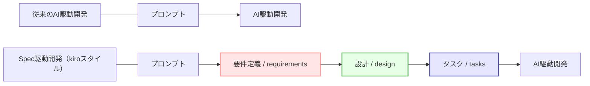

# 話題のkiro

最近話題になっているAWS製のIDE **「kiro」の仕様駆動開発(Spec駆動開発)** を試してみました。

https://kiro.dev/


すでに界隈では十分話題になっていますが、出力が面白いんですよね。

実際のコーディングをはじめる要件定義（requirements）・設計（design）・タスク（tasks）がすべてMarkdownで整理されて出てきます。
これは **「バイブス（感覚）ではなく、ドキュメントを信頼しようぜ！」** というKiroからのメッセージです。



自然言語をいきなりコードに落とし込むのではなく、一度設計に落とし込むことで、
- **ユーザーの要件を満たした開発**
- **バグや手戻りの少ないコーディング**

を実現できる、という理屈ですね。


## やってみて強く感じた「要件定義を依頼するプロンプトむずくね」

正直、私はいまだ料金設定やリクエスト消費の仕組みが上手く理解できていません。
（情報が錯綜しすぎやねん）

そのため、色々と検証しきれているわけではありませんが、一番気になったこと。

Kiroの「ざっくりした相談でも上手く要件定義に落とし込んでくれる」特徴、
その"いき過ぎる特技"ゆえに、

**「どんなプロンプトで良い要件定義が始まるのか？」**

という疑問を抱いてしまいます。

実際テキトーなプロンプトでもイイ感じに要件定義を作成してくれることは他の方の検証からもわかるのですが、このプロンプトの違いにより、どれだけ違いが出るのだろうと気になります。

その部分をAIにどう頼むべきか、少し実験してみます。

# 実践してみたこと


## テーマ「ZennのXverっぽいスマホアプリ」の開発

現在存在していないかつ、なんとなく誰でも脳内再生しやすいアプリということで、以下3つのプロンプトを用いてこのテーマのアプリ開発要件定義～タスクリストまでを作成してみます。

なおすべてモデルはClaude Sonnet 4.0を使用しています。

## ざっくり VS 小～中程度の制約条件 VS GPT-5

### ざっくり相談プロンプト

* 作成方法
  ・ほぼ丸投げ
  ・「作りたいテーマ」だけ伝える

:::details 実際に投げたプロンプト（例）
「ZennのXverっぽいスマホアプリを作りたい」
:::

---

### 小～中程度の制約条件を付けたプロンプト

* 作成方法
  ・機能要件を思いつくままに列挙
  ・技術スタックや前提条件も指定

:::details 実際に投げたプロンプト（例）
「ZennのXverっぽいスマホアプリの要件定義を作成してください。
必須機能は、ユーザー登録、記事投稿、検索、コメント、通知です。
アーキテクチャはAzureクラウドを前提に、フロントエンドはNext.js、バックエンドはAzure App Service、DBはAzure Cosmos DBを使用してください。
認証はEntra ID、ファイルストレージはAzure Blob Storageを利用します。
非機能要件やセキュリティも含めて、タスクリストまで整理してください。」
:::

---

### GPT-5で壁打ちプロンプト

* 作成方法
  ・自分の叩き台を提示
  ・AIに「Kiroに依頼する用」として良いプロンプトかチェックを依頼

:::details 実際に投げたプロンプト（例）

```md
## テーマ
「ZennのXverっぽいスマホアプリ」をAzureクラウド上で開発したいです。  
目的は、ユーザーが記事を書いて共有し、検索やコメント・通知で交流できるコミュニティを作ることです。  

## 前提条件
- クラウドはAzureを利用すること  
- フロントエンド：Next.js  
- バックエンド：Azure App Service  
- データベース：Azure Cosmos DB  
- 認証：Microsoft Entra ID  
- ファイル保存：Azure Blob Storage  
- デプロイ：Azure DevOpsまたはGitHub Actions（CI/CD）  
- MVP段階でまずは日本国内ユーザーのみ対象  

## 必須機能
- ユーザー登録 / 認証  
- 記事投稿 / 編集 / 削除  
- 記事検索（タグ・キーワード）  
- コメント  
- 通知（新規コメント・いいね）  
- マイページ（自分の記事・コメント履歴）  

## 優先度の低い機能（将来拡張）
- いいね機能  
- フォロー機能  
- おすすめ記事レコメンド  

## 非機能要件
- セキュリティ：Entra ID認証＋RBAC、OWASP対策  
- スケーラビリティ：Azure App Serviceの自動スケール対応  
- 可用性：99.9%以上  
- 運用性：監視はAzure Monitor、ログはApplication Insights  
- コスト：月額5万円以内（開発・検証環境は別）  

## 期待するアウトプット
1. 要件定義（機能要件と非機能要件を章立てして）  
2. アーキテクチャ設計（サービス構成、データモデル）  
3. 実装タスクリスト（MVPと将来拡張に分ける）  
4. 不足要件やリスクの指摘  
```

:::

---

# 比較

## ざっくり

## 小～中程度の制約

## GPT-5のプロンプト

# 考察


# 重要だと思ったこと

## 1. Why（目的）を最初に置く

AIに「こんなアプリを作りたい」とだけ伝えると、だいたいそれっぽい機能一覧が返ってきます。
でも要件定義の本質は「なぜ作るのか、どんな価値を届けたいのか」。

背景・目的・解決したい課題を含めて伝えると、AIが書く要件にも筋が通るようになります。

例：

私たちは〇〇業務の非効率を解消したい。
従業員の手入力を減らして、生産性を20%改善することをゴールとしたアプリを設計したい。


## 2. ステークホルダーと制約条件を明示する

現場でよくあるのは「理想的だけど実現不可能」な要件。
それを防ぐには 誰が使うのか、予算・納期・利用環境 を最初に提示しておくのが大事です。

例：

利用者は非エンジニアの事務担当。
予算は小規模（SaaS活用前提）、納期は3か月以内。

これだけで、AIの出力が「夢物語」から「現実的な仕様」にぐっと寄ってきます。


## 3. 出力形式と粒度を指定する

AIに書かせる要件は、そのままレビューして使うことが多いはず。
だからこそ「粒度」や「フォーマット」を最初に決めてしまうのが効きます。

Markdownの表や、機能要件／非機能要件の分離を指定すると読みやすくなります。

例：

要件をMarkdownで3つに分けてください。
1. 機能要件
2. 非機能要件
3. 成果物イメージ（表や箇条書きで）


# まとめ

結論として、AIに良い要件定義を書かせるためのプロンプトは
Why（目的）＋ Who/Constraints（制約条件）＋ How to Output（出力指示）
この3点セットを押さえることがカギだと考えます。
• 目的が抜けると「ただの機能リスト」になる
• 制約条件が抜けると「理想論の仕様」になる
• 出力指示が抜けると「レビュー不能なドキュメント」になる

AIに丸投げするのではなく、「問いの質」が要件定義の質を決める。
これって、まさにコンサルタントの役割が残る領域なんじゃないかと思います。

