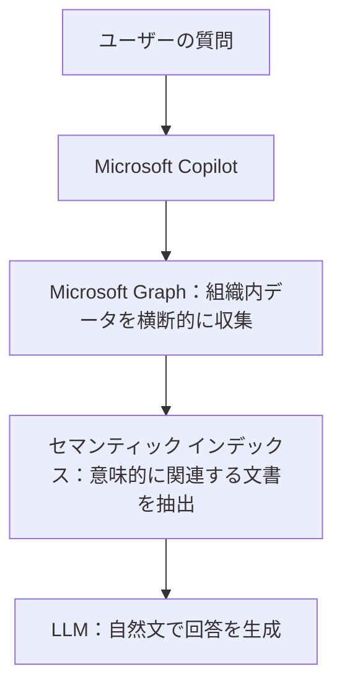
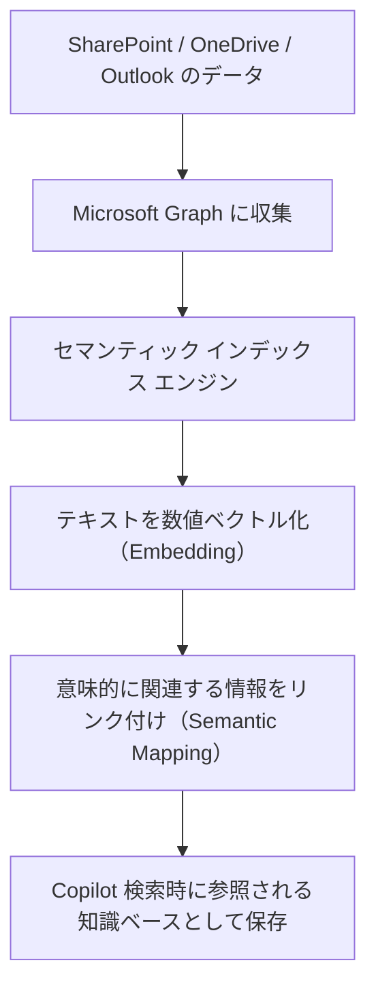
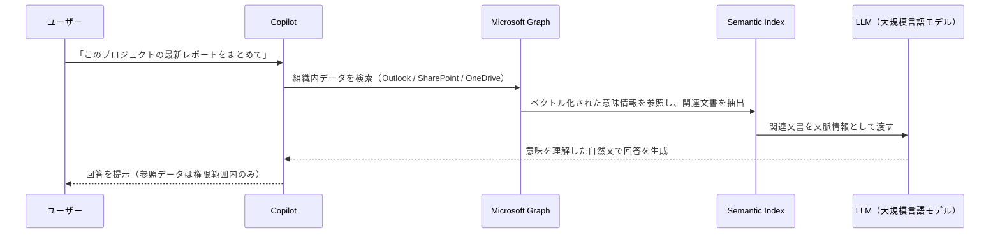

# 1. はじめに：Copilotの“検索精度の高さ”の秘密

最近、Microsoft 365 Copilot の導入が進み、「社内の○○プロジェクトの関連資料をまとめて」「このパワーポイントを要約して」などのように組織内のOfficeファイルを広く的確に情報を探し出してくれるようになりました。

https://learn.microsoft.com/ja-jp/copilot/microsoft-365/microsoft-365-copilot-overview#copilot-features-in-microsoft-365-apps

この“的確に見つけ出す力”の裏には、**セマンティック インデックス（Semantic Index）**という
意味を理解して情報を整理する仕組みが動いています。

本記事では、そのセマンティックインデックスがどのようにCopilotを支えているのかを、難しい専門用語をできるだけ避けながら、わかりやすく解説していきます。

# 2. 従来の検索との違い：キーワードから「意味」へ

従来の企業内検索は、とてもシンプルでした。
たとえば「見積書」と入力すれば、その文字列が含まれるファイルしかヒットしません。
検索は“文字の一致”にしか反応していませんでした。

一方、セマンティックインデックスはここが違います。「見積もり書」や「Quotation」のように表現が違っても、 **文脈的に同じ意味を持つ情報** を見つけることができます。

この“意味を理解する力”を支えているのが、
自然言語処理と呼ばれる技術と、テキストを数値化して関連性を測る**ベクトル表現（Embedding）**です。

現在Microsoft 365 Copilotを使用している組織は、自動的にこのテナントレベルのインデックスを持つようになりました。 
組織側でインデックス作成を行うプロセスが必要ありません。

**要点**

> Copilotは「単語」ではなく「概念ベクトル」で文書を理解している。

https://learn.microsoft.com/ja-jp/microsoftsearch/semantic-index-for-copilot#how-semantic-indexing-works

# 3. Microsoft Graphとの関係

Copilotは、単体で社内データを検索しているわけではありません。
その背後では、**Microsoft Graph** という情報ネットワークが動いています。

Microsoft Graph は、メール、ファイル、チャット、予定など **Microsoft 365 全体の情報を横断的に扱うためのAPI** です。
これによって、Copilotは「どんなデータが、どこにあるのか」を把握できます。

https://learn.microsoft.com/ja-jp/graph/overview

一方で、**セマンティック インデックス**はそのGraphデータをもとに、
内容の「意味」や「関連性」を理解するための**知能層**として機能します。

つまり、

1.  Graph が **データの位置と種類** を教え、
2.  セマンティックインデックス が **意味的なつながり** を見つけ出す。

この2つの組み合わせによって、Copilotは
単なる「検索ツール」ではなく、「文脈を理解して答えるアシスタント」になるのです。

📘 図で表すと：

# 4. どうやって動いているのか

Microsoft 365 Copilot のセマンティック インデックスは、
組織全体の情報を“意味のネットワーク”として整理する仕組みです。
ユーザーや管理者が明示的に操作する必要はなく、Microsoft Graph 経由で自動的に生成・更新されます。

### インデックス生成の仕組み

* テナント単位で自動生成（手動設定不要）
* SharePoint / OneDrive / Outlook / Teams などの Microsoft 365 データを対象に、文書・メール本文を**ベクトル化（Embedding）**して登録
* 意味マッピングにより、関連文書どうしを文脈的に関連付け

 **処理イメージ**

### 更新タイミングと反映スピード

| 対象                      | 更新頻度     |
| ----------------------- | -------- |
| ユーザーのメールボックス（Outlookなど） | ほぼリアルタイム |
| SharePoint Online サイト   | 毎日（1日ごと） |

Copilot の“最新情報への対応力”は、この自動更新サイクルに支えられています。
特に Outlook のリアルタイム反映は、自然な会話応答の裏側で大きな役割を果たしています。

https://learn.microsoft.com/ja-jp/microsoftsearch/semantic-index-for-copilot?utm_source=chatgpt.com#index-updates

### セキュリティとデータ境界

セマンティック インデックスは Microsoft 365 の
RBACとコンプライアンス構造に準拠しています。

 “検索できる情報” = “自分にアクセス権がある情報”なので、他部門や機密サイトの内容が Copilot の回答に混ざることはありません。
また、インデックス化された情報は「検索・文脈補助」目的でのみ利用され、
LLM が再学習したり Microsoft 外部に送信されることはありません。

### 処理全体の流れ（全体アーキテクチャ）

# 5. 管理者が押さえるべきポイント

### 自動有効かと除外設定

上述の通り、Microsoft 365 Copilot におけるセマンティックインデックスは、テナントレベルで自動的に生成されます。
管理者が特別に “オンにする” 必要はなく、サービス提供側でバックグラウンドに用意されています。そのため、導入にあたってインデックス構築の大がかりな作業は基本的には不要です。

ただし、すべてのデータを自動的に “意味的に可検索化” されたくないケースもあります。たとえば、人事・給与・財務データなど機密性が高い情報を検索対象から除外したい場合。
そのような時には、SharePoint Online サイトを “検索対象から除外” に設定することが可能です。 

具体的には、以下の手順です。
この設定をすることで、組織ポリシーで「このサイトからの検索および索引化を避けたい」という要件に対応できます。

https://learn.microsoft.com/ja-jp/sharepoint/restricted-content-discovery

### プライバシー・コンプライアンスを維持

セマンティックインデックスは、以下のようなセキュリティ・コンプライアンス設計を前提としています。

* インデックス化されたデータであっても、ユーザーが **アクセス権を持っていない情報は返答に使われない**（RBAC準拠）です。
* プロンプト、応答、インデックス化されたデータが、基盤となる大規模言語モデル（LLM）の**再学習データとして使用されない**という案内も明記されています。
* 組織の地域／データ保管要件（データレジデンシー）や GDPR 等の法令にも準拠する設計です。 

このように、「検索できる範囲＝自分がアクセス権を持っている範囲」という原則が徹底されており、管理者としてはこの点をユーザーに説明することで「Copilotが社内データを無制限に閲覧しているのでは？」という誤解を防ぐことができます。

# まとめ：Copilotの“賢さ”はセマンティックインデックスから

セマンティックインデックスは、Microsoft 365 Copilot の**頭脳を支える土台**です。
ただのキーワード検索ではなく、「意味」を理解して情報をつなげることで、
人が探したい文脈に沿った答えを導き出してくれます。

そして、Microsoft Graph と組み合わせることで、
社内のファイル・メール・チャットといった膨大な情報を
**“ひとつの知識ネットワーク”として整理し、賢く引き出せる環境**を実現しています。

Copilot を単なる「AIアシスタント」として使うのではなく、
**“企業内ナレッジを意味でつなぐ基盤”**として活かすことで、
情報活用の質が一段上がります。

